# NoSQL: Social Network API

## Deployable Video Link
https://watch.screencastify.com/v/0TxgtsjMrgLUX0qu5BAA

## Goal
The task was to make a NoSQL Social Media application that passed all routing test on Insomnia.

## Technology Use
  - Javascript
  - Node.js
  - Express
  - Mongoose
  - MongoDB
  - VS Code
  - Git Bash 
  - GitHub

## Execution
The first step when creating the social media application with NoSQL was to create the files associated with MVC but with the added benefit of not having a schema.sql file since MongoDB has the added benefit of being a nonstructural version of MySQL. Instead, the schema would be in the models themselves because MongoDB is that flexible. Schemas for reactions and thoughts were in the Thought model while the schema for the users in the User schema. The schema for users in the User schema:

userSchema code:
```Javascript
const userSchema = new Schema(
  {
    username: {
      type: String,
      required: true,
      unique: true,
      trim: true,
    },
    email: {
      type: String, 
      validate: {
        validator: function(v) {
          return /^([a-z0-9_\.-]+)@([\da-z\.-]+)\.([a-z\.]{2,6})$/.test(v);
        }},

      required: true,
      unique: true,
    },
  thoughts : [
      {type: Schema.Types.ObjectId,ref:'Thought'}
  ],
  friends : [
    {type: Schema.Types.ObjectId,ref:'User'}
  ],
  },
  {
    toJSON: {
      getters: true,
    },
  }
);
userSchema.virtual('friendCount').get(function() {
  return this.friends.length;
});
```
As shown above, the user schema interwoven in the User model so that user routes could utilized both the schema and the model. This would be controlled by the user-controller.js file. The same can be said about the Thought model but with said model there is schemas for thoughts and reaction.

Routes in NoSQL, unlike MySQL, was relatively short and succinct. 

The following code is and example code from user-routes.js:
```Javascript
const router = require('express').Router();
const {
getUser,
getSingleUser,
createUser,
deleteUser,
updateUser,
addFriend,
removeFriend
} = require('../../controllers/user-controller');


router.route('/').get(getUser).post(createUser);


router.route('/:userId').get(getSingleUser).delete(deleteUser).put(updateUser);


router.route('/:userId/friends/:friendId').post(addFriend).delete(removeFriend)
module.exports = router;
```
Each const controls each route in Insomnia like updateUser controls put route test, getUser for get routes etc. Each router enables the user to use the said requests in Insomnia. The same can be said about thought-controller.js.

An example of then code from thought-routes.js is shown below:
```Javascript
const router = require('express').Router();
const {
getThought,
getSingleThought,
createThought,
deleteThought,
updateThought,
addReaction,
removeReaction
} = require('../../controllers/thought-controllers');

router.route('/').get(getThought).post(createThought);

router.route('/:thoughtId').get(getSingleThought).delete(deleteThought).put(updateThought);

router.route('/:thoughtId/reactions/:reactionId').delete(removeReaction)
router.route('/:thoughtId/reactions/').post(addReaction)

module.exports = router;
```
The models and the routes are controlled by their controllers. For example since reaction schema and thought schema in Thought.js while friends and user schema are in User.js. Example of both are shown below.

user-controller.js code:

```Javascript
const { User } = require('../models');

module.exports = {
  // Get all users
  getUser(req, res) {
    User.find().populate("thoughts").populate("friends")
      .then((users) => res.json(users))
      .catch((err) => res.status(500).json(err));
  },
  // Get a user
  getSingleUser(req, res) {
    User.findOne({ _id: req.params.userId })
      .select('-__v')
      .then((user) =>
        !user
          ? res.status(404).json({ message: 'No user with that ID' })
          : res.json(user)
      )
      .catch((err) => res.status(500).json(err));
  },
  // Create a user
  createUser(req, res) {
    User.create(req.body)
      .then((user) => res.json(user))
      .catch((err) => {
        console.log(err);
        return res.status(500).json(err);
      });
  },
  // Delete a user
  deleteUser(req, res) {
    User.findOneAndDelete({ _id: req.params.userId })
      .then((user) =>{
        if (!user) {
          return res.status(404).json({ message: 'No user with that ID' })
        }
  })
      .then(() => res.json({ message: 'user deleted!' }))
      .catch((err) => res.status(500).json(err));
  },
  // Update a user
  updateUser(req, res) {
    User.findOneAndUpdate(
      { _id: req.params.userId },
      { $set: req.body },
      { runValidators: true, new: true }
    )
      .then((user) =>
        !user
          ? res.status(404).json({ message: 'No user with this id!' })
          : res.json(user)
      )
      .catch((err) => res.status(500).json(err));
  },
  addFriend(req, res) {
    User.findOneAndUpdate(
      { _id: req.params.userId },
      { $push: {
        friends: req.params.friendId
      }},
      { runValidators: true, new: true }
    )
      .then((user) =>
        !user
          ? res.status(404).json({ message: 'No user friend with this id!' })
          : res.json(user)
      )
      .catch((err) => res.status(500).json(err));
  },
  removeFriend(req, res) {
    User.findOneAndUpdate(
      { _id: req.params.userId },
      { $pull: {
        friends: req.params.friendId
      }},
      { runValidators: true, new: true }
    )
      .then((user) =>
        !user
          ? res.status(404).json({ message: 'No user friend with this id!' })
          : res.json(user)
      )
      .catch((err) => res.status(500).json(err));
  },
};
```
thought-controller.js code:

```Javascript
const { User, Thought } = require('../models');

module.exports = {
  // Get all thoughts
  getThought(req, res) {
    Thought.find()
      .then((thoughts) => res.json(thoughts))
      .catch((err) => res.status(500).json(err));
  },
  // Get a thought
  getSingleThought(req, res) {
    Thought.findOne({ _id: req.params.thoughtId })
      .select('-__v')
      .then((thought) =>
        !thought
          ? res.status(404).json({ message: 'No thought with that ID' })
          : res.json(thought)
      )
      .catch((err) => res.status(500).json(err));
  },
  // Create a thought
  createThought(req, res) {
    Thought.create(req.body)
      .then((thought) => {
        User.findOneAndUpdate(
          { _id: req.body.userId },
          { $push: {
            thoughts: thought._id
          } },
          { new: true }
        )
          .then((user) =>
            !user
              ? res.status(404).json({ message: 'No user with thought with this id!' })
              : res.json(user)
          )
          .catch((err) => res.status(500).json(err));
      })
      .catch((err) => {
        console.log(err);
        return res.status(500).json(err);
      });
  },
  // Delete a thought
  deleteThought(req, res) {
    Thought.findOneAndDelete({ _id: req.params.thoughtId })
      .then((thought) =>
        !thought
          ? res.status(404).json({ message: 'No thought with that ID' })
          : Thought.findOneAndUpdate({ thoughts: req.params.thoughtId }, 
          { $pull: { thoughts : req.params.thoughtId } }
            // { _id: { $pull: thought.user } })
          ))
      .then(() => res.json({ message: 'thought deleted!' }))
      .catch((err) => res.status(500).json(err));
  },
  // Update a thought
  updateThought(req, res) {
    Thought.findOneAndUpdate(
      { _id: req.params.thoughtId },
      { $set: req.body },
      { runValidators: true, new: true }
    )
      .then((thought) =>
        !thought
          ? res.status(404).json({ message: 'No thought with this id!' })
          : res.json(thought)
      )
      .catch((err) => res.status(500).json(err));
  },
  addReaction(req, res) {
    Thought.findOneAndUpdate(
      { _id: req.params.thoughtId },
      { $push: {
        reactions: req.body
      }},
      { runValidators: true, new: true }
    )
      .then((user) =>
        !user
          ? res.status(404).json({ message: 'No user friend with this id!' })
          : res.json(user)
      )
      .catch((err) => res.status(500).json(err));
  },
  removeReaction(req, res) {
    Thought.findOneAndUpdate(
      { _id: req.params.thoughtId },
      { $pull: {
        reactions: {
            reactionId: req.params.reactionId
        }
      }},
      { runValidators: true, new: true }
    )
      .then((user) =>
        !user
          ? res.status(404).json({ message: 'No user friend with this id!' })
          : res.json(user)
      )
      .catch((err) => res.status(500).json(err));
  },
};
 ```
The last part was to make the index.js files in api and routes and have the server.js. The server.js is the brain of the entire code. With out the file, none of the applications works That code is show below:

 ```Javascript
const express = require('express');
const db = require('./config/connection');

const routes = require('./routes')

const PORT = process.env.PORT || 3001;
const app = express();

app.use(express.urlencoded({ extended: true }));
app.use(express.json());
app.use(routes);

db.once('open', () => {
    app.listen(PORT, () => {
      console.log(`API server running on port https//${PORT}!`);
    });
  });
```
## Result

The following website demonstrates what the final product looks like:

Get request for User:
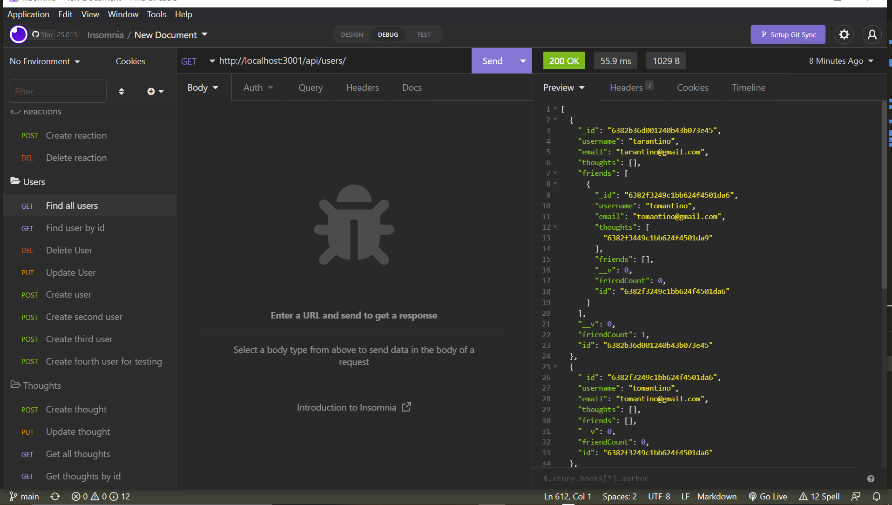

Get by id request for User:
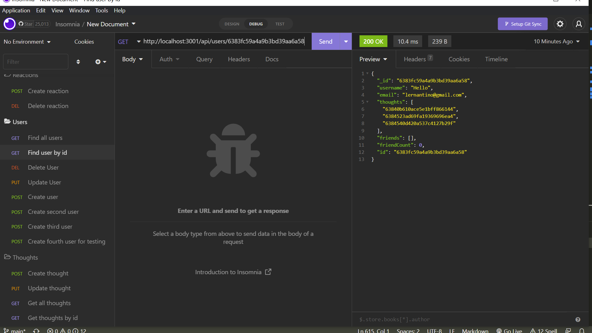

Put request for User:
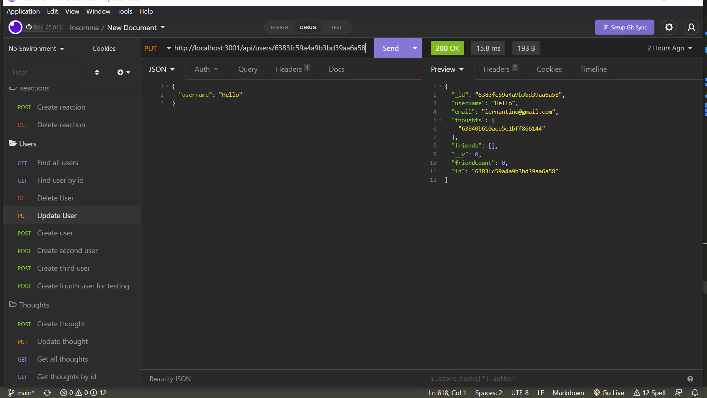

Delete request for User:
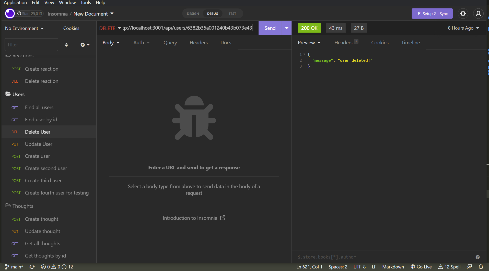


Get request for Thought:
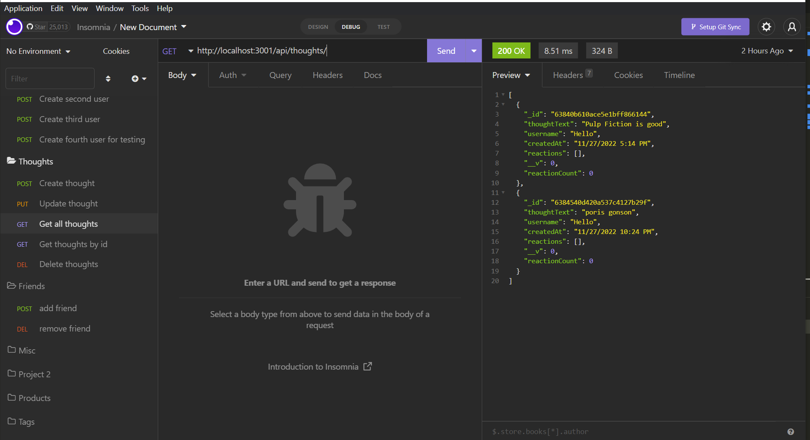

Get by id request for Thought:
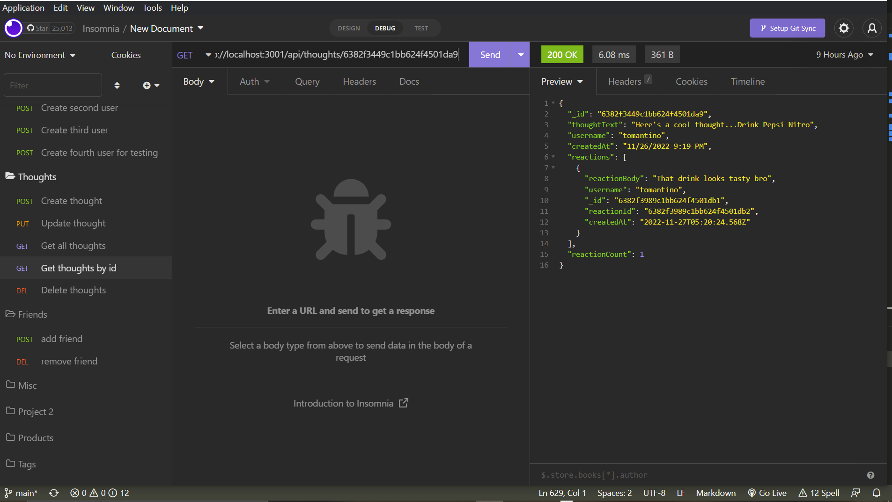

Post request for Thought:
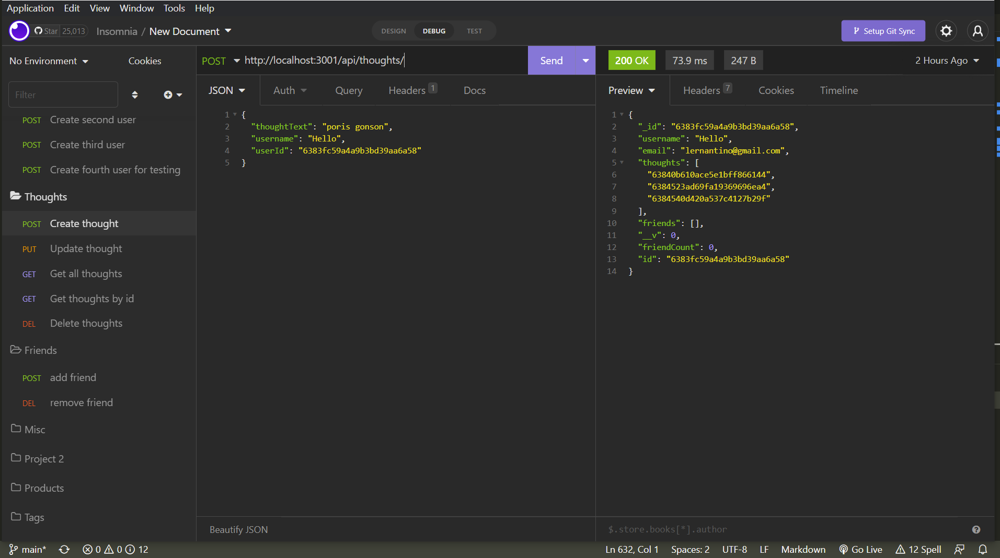

Put request for Thought:
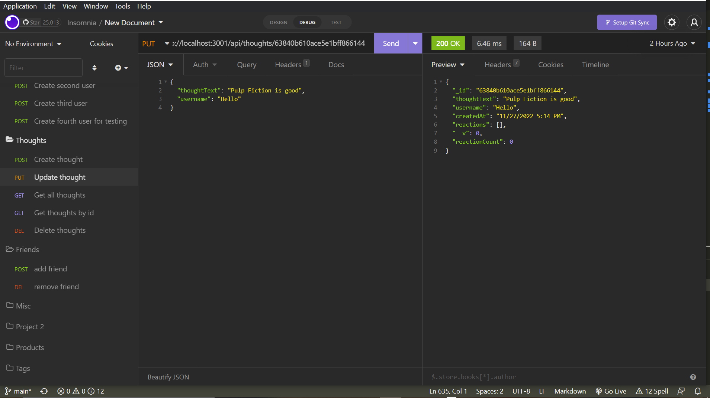

Delete request for Thought:
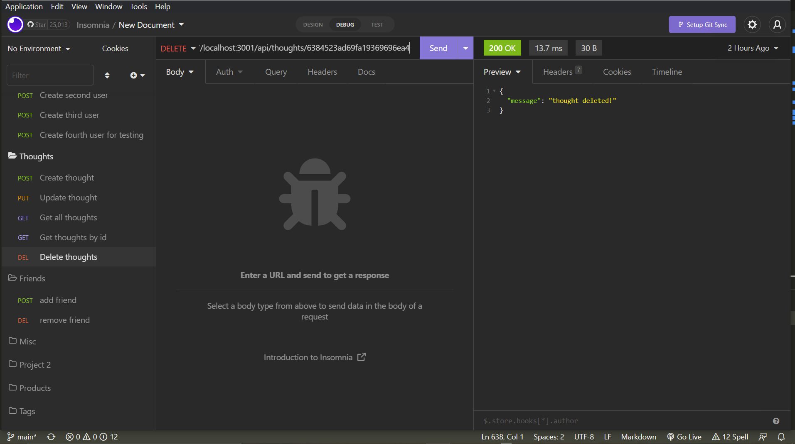


Post request for Friend:
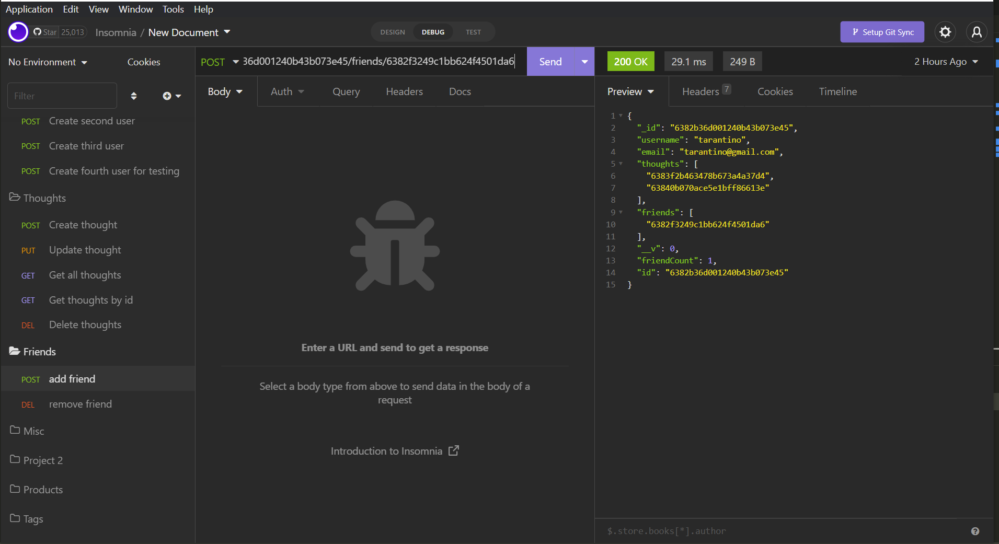

Delete request for Friend:
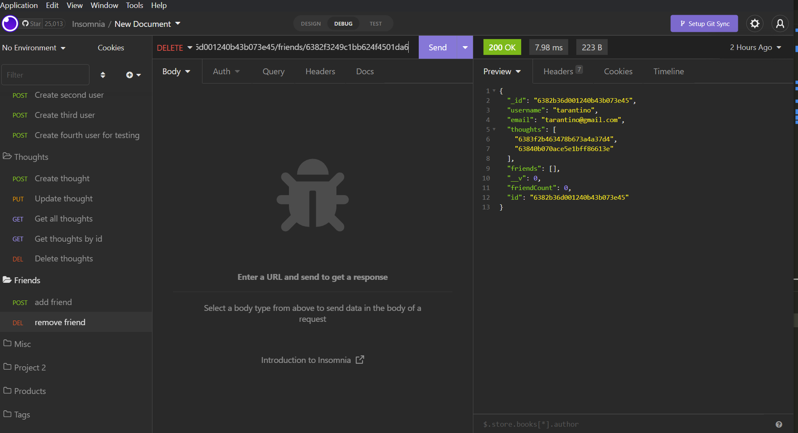


Post request for Reaction:
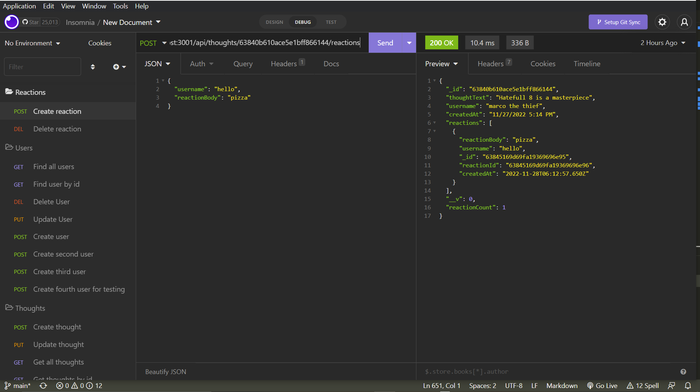

Delete request for Reaction:
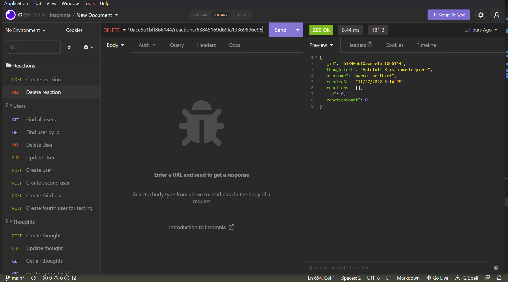


